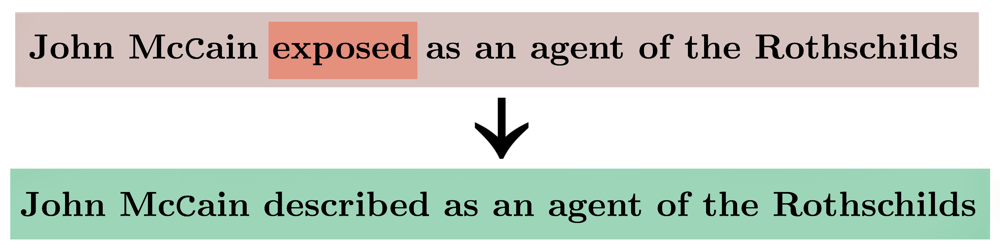

# Neutralizing Biased Text

This repo contains code for the paper, "[Automatically Neutralizing Subjective Bias in Text](https://arxiv.org/abs/1911.09709)".

Concretely this means algorithms for
* Identifying biased words in sentences.
* Neutralizing bias in sentences.



This repo was tested with python 3.7.7. 

## Quickstart

These commands will download data and a pretrained model before running inference.
```
$ cd src/
$ python3 -m venv venv
$ source venv/bin/activate
$ pip install -r requirements.txt
$ python
>> import nltk; nltk.download("punkt")
$ sh download_data_ckpt_and_run_inference.sh
```

You can also run `sh integration_test.sh` to further verify that everything is installed correctly and working as it should be. 

## Data

Click [this link to download](http://bit.ly/bias-corpus) (100MB, expands to 500MB). 

If that link is broken, try this mirror: [download link](https://www.dropbox.com/s/qol3rmn0rq0dfhn/bias_data.zip?dl=0)


## Pretrained model
Click [this link](https://bit.ly/bias-model) to download a (Modular) model checkpoint. We used [this command](https://nlp.stanford.edu/projects/bias/train.sh) to train it. 


## Overview

`harvest/`: Code for making the dataset. It works by crawling and filtering Wikipedia for bias-driven edits.

`src/`: Code for training models and using trained models to run inference. The models implemented here are referred to as `MODULAR` and `CONCURRENT` in the paper.

## Usage

Please see `src/README.md` for bias neutralization directions.

See `harvest/README.md` for making a new dataset (as opposed to downloading the one available above). 


<!--


Our code-based is structured in the following format: 

* `harvest/`: Provides utilities for crawling Wikipedia articles and for generating a parallel dataset of biased-debiased sentences. Our data generation approach mirrors that proposed by Recasens et al. (https://nlp.stanford.edu/pubs/neutrality.pdf). A final version of our crawled dataset can be found at https://stanford.io/2Q8G3bX. The zip file containing the data is 100MB
and expands to 500MB. 
* `src/`: This folder provides the model architectures, and training procedures for both detecting bias and generating 'debiased' versions of text. It is sub-divided in the following manner: 
    + `src/tagging/`: Functionality for detecting bias in a given input sentence. The model architectures, which are based on BERT and use the huggingface implementation, can be found under model.py. Simple baselines we implement, such as logistic regression classifiers, are presented in baseline.py. The primary training loop can be found under train.py. Utilities used by both model.py and train.py can be found under util.py.  To spawn a basic training and evaluation run, you can call the following from the root directory: 

    ```bash
    python tagging/train.py --train <training dataset> --test <test dataset> --working_dir <dir> --train_batch_size <batch_size> --test_batch_size <batch_size>  --hidden_size <hidden_size> --debug_skip
    ```

    By default, the tagging module is trained to incorporate the linguistic features enumerated by Recasens et al. For more information on how we incorporate these features into our BERT architecture, we direct you to the accompanying conference publication. In general terms, Marta's features comprise 32 linguistic features that are extracted for each word in a given sentence. In the process of training our model, we combine the BERT based word representation for each word with the words' accompanying linguistic features. We specify different ways in which these two representations can be combined, namely via concatenation or addition. We also allow users to specify whether the lingusitic features should be conatenated at the top or bottom of a given word's BERT embedding. These settings and the default specifications can be found under 'src/shared/args.py'. In addition to Recasens features, we also enable user to learn a category embedding, in addition to individual word embeddings, that specify a latent representation of the category of the article from which the input was extracted. These categories are derived from a set of predetermined article categories specified by the Wikipedia foundation. In our paper, we show empirically that conditioning our bias detection system on the given type of input enables the system to more accurately find bias. Setting and default specifications for jointly learning category embeddings can also be accessed under 'src/shared/args.py'.

    + `src/seq2seq/`: Functionality for generating debiased versions of a given biased sentence. As in the tagging directory, the model.py directory establishes the model architectures we use 
    in order to generate a debiased version for a given biased sentence. The models we establish are variants of basic Seq-2-Seq networks, with varying attention implementations. We provide an additional architecture of a generative debiasing model under transformer_decoder.py that uses a transformer-based architecture as a decoding module. The training procedure can again be found under train.py. To spawn a basic training and evaluation run, you can call the following from the root directory: 

    ```bash
    python seq2seq/train.py --train <training dataset> --test <test dataset> --working_dir <dir> --max_seq_len <seq_size> --train_batch_size <batch_size>  --test_batch_size <batch_size>   --hidden_size  <hidden_size> --debug_skip
    ```

    + `src/joint/`: Combines together the bias detection and debiasing modules into one end-to-end model that can be trained, and evaluated jointly. As in the other modules, the joint model architecture is stored under model.py and the primary training loop can be found under train.py. To spawn a basic training and evaluation run of our joint end-to-end framework, you can call the following from the root directory: 

    ```bash
    python joint/train.py --train  <training dataset> --test <test dataset>  --extra_features_top --pre_enrich --activation_hidden --tagging_pretrain_epochs 1 --pretrain_epochs 4     --learning_rate 0.0003 --epochs 2 --hidden_size 10 --train_batch_size 4 --test_batch_size 4     --bert_full_embeddings --debias_weight 1.3 --freeze_tagger --token_softmax --sequence_softmax  --working_dir <dir>  --debug_skip
    ```

    + `src/lexicons/`: Lexicons of words and their associated linguistic properties, such as impliocations, hedges, and factives. We require these lexicons to derive the features used by Recasens. et al to detect bias. 

    + `src/shared/`: A set of utilities that are shared by both the bias detection and debias generation modules, such as an implementation of beam search. We also store, constants and arguments that are shared globally. Args.py stores the entire set of arguments that can be passed into any one of the modules, along with a default specification. 
    
    
-->

